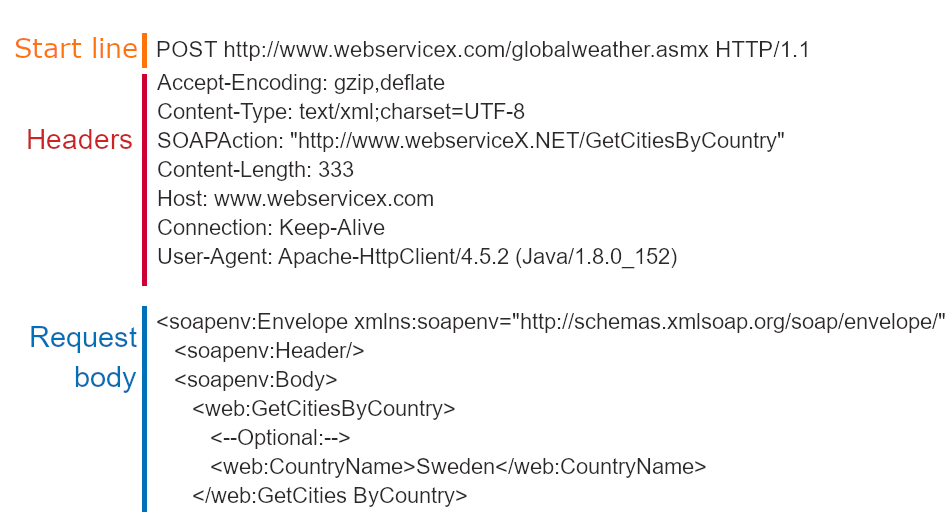
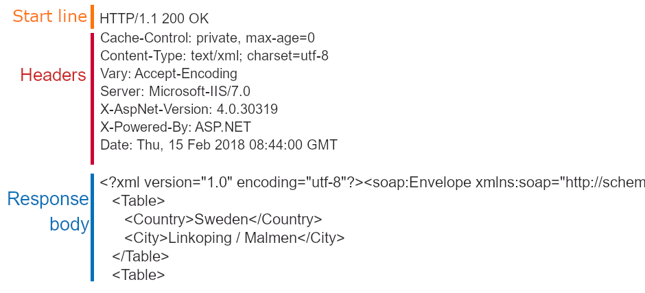
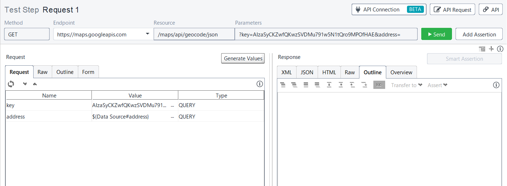

# ReadyAPIハンズオンセミナー

本ドキュメントはSmartBear社のAPIテストツールReadyAPIのハンズオン用の資料です。

ReadyAPIユーザーガイドの中で、クイックスタート／チュートリアルの部分を抜粋して翻訳したものです。

インストールファイルの入手、各機能の詳細を含んだ最新バージョンのReadyAPIのユーザーガイドは、SmartBear社の下記のサイトで参照できます。

[https://support.smartbear.com/readyapi/docs/get-started.html](https://support.smartbear.com/readyapi/docs/get-started.html)


## 目次

- [ReadyAPIハンズオンセミナー](#readyapiハンズオンセミナー)
  - [Web API の基礎](#web-api-の基礎)
    - [API とは](#api-とは)
    - [基本概念](#基本概念)
  - [機能テスト](#機能テスト)
    - [1) 機能テストの作成](#1-機能テストの作成)
    - [2) テストプロジェクトの探索](#2-テストプロジェクトの探索)
    - [3) 機能テストの変更](#3-機能テストの変更)
    - [4) 機能テストの実行](#4-機能テストの実行)
    - [5) 機能テストにアサーションを追加](#5-機能テストにアサーションを追加)
  - [データドリブンテスト](#データドリブンテスト)
    - [1) プロジェクト作成](#1-プロジェクト作成)
    - [2) データソース追加](#2-データソース追加)
    - [3) データソースの設定](#3-データソースの設定)
    - [4) リクエストの設定](#4-リクエストの設定)
    - [5) テストの実行と検証](#5-テストの実行と検証)
  - [負荷テスト](#負荷テスト)
    - [1) 新規負荷テストの作成](#1-新規負荷テストの作成)
    - [2) 負荷テストエディターインターフェースの概要](#2-負荷テストエディターインターフェースの概要)
    - [3) 作成した負荷テストの実行](#3-作成した負荷テストの実行)
    - [4) テスト結果の表示](#4-テスト結果の表示)
    - [5) 負荷テストの変更](#5-負荷テストの変更)
    - [6) 負荷テストへのアサーションの追加](#6-負荷テストへのアサーションの追加)


<div style="page-break-before:always"></div>


<a id="anchor0"></a>

## Web API の基礎

<a id="anchor0-1"></a>

### API とは

API（Application Programming Interface）とは、コンピュータ・プログラムの開発者が、自作したプログラムを他の開発者に使ってもらうときの「手続き・使い方・決まり」の総称です。プログラム自体を指すことも、その開発文書のことを指すことも、プログラムの設計理念を指すこともあります。どうにも抽象的な用語ですが、スマートフォンのアプリ操作にも当たり前に使われる技術です。

「ぐるなび」や「食べログ」で行きたいお店を探すとき、所在地を確認するために、わざわざ別のブラウザで地図を検索したりはしないでしょう。グルメサイトの画面内で「地図」メニューを開けば、そこにはGoogle Mapの地図が表示されますし、現在地からの道順も簡単に検索できます。

でもこの地図、もちろんグルメサイトが作成したものではありません。地図情報はGoogleが提供しています。グルメサイトは提供されたデータを表示するだけです。このようにAPIサービスは、あるアプリが他のアプリの機能を呼び出す「代理」をしてくれます。

> 出展/抜粋：[APIマーケット – データ流通市場の歩き方](https://www.j-dex.co.jp/datamarketguide/archives/tag/api%E3%83%9E%E3%83%BC%E3%82%B1%E3%83%83%E3%83%88)

例：

- Google Map API
- [OpenWeather API](https://openweathermap.org/api)
- AWS, Azure, GCPの各種API（言語解析、画像解析、AI、DeepLearningなど）
- Twitter, Facebook, Instagramなど各種SNSのAPI


<a id="anchor0-2"></a>

### 基本概念

> [Basic Concepts \| ReadyAPI Documentation](https://support.smartbear.com/readyapi/docs/functional/tutorial/your-first-test/basic-concepts.html)をベースにした日本語ドキュメントです。

ReadyAPIを使用してテストを作成および実行するには、Webサービステクノロジーとテストの原則を一般的に理解している必要があります。ReadyAPIをより早く使い始めるのに役立つ概要をまとめました。

用語：

- Webサービスは、クライアントとサーバーがHTTPプロトコルまたはHTTPに基づくその他のプロトコルを介してWeb経由でデータを交換するクライアント/サーバーアプリケーションです。このようなアプリケーションの例には、ナビゲーションソフトウェア、オンラインバンククライアント、気象監視システムなどが含まれます。
- クライアントがリクエストを送信するURLには、テスト対象のサーバー（**ホスト**）、通信に使用されるポート番号、およびリクエストされたサーバー**リソース**（ページやファイルパスなど）に関する情報が含まれています。


- クライアントがサーバーに送信する**リクエスト**の構造は次のとおりです。
    - HTTPメソッド（GET、POST、DELETEなど）、ターゲットURL、およびプロトコルバージョンを指定する開始行。
    - レスポンスデータの予想される形式、またはリクエストデータのサイズと形式などの追加情報を渡すヘッダー。
    - （オプション）リクエストボディ。一部のリクエストタイプはそれを使用しません。



- レスポンスの構造は似ています。
    - レスポンスコードとメッセージの開始行。頻繁に使用されるコードには、`200 OK`（成功）と`404 Not Found`（失敗、要求されたリソースが見つからなかった）があります。
    - レスポンスデータ形式を説明し、Cookie、サーバー情報などの追加値を含むヘッダー。
    - レスポンスボディ。たとえば、要求されたデータ、画像、ファイルなどを含む配列。



- リクエストとレスポンスのボディで頻繁に使用される形式は、JSONとXMLです。
- クライアントが実行のためにサーバーに送信するコマンドは、サービスアーキテクチャスタイル（SOAPまたはREST、以下を参照）に応じて、**アクション**、**メソッド**、または**オペレーション**と呼ばれます。
- Webサービスの2つの一般的なアーキテクチャスタイルは、SOAPとRESTです。
    - SOAPサービスは、HTTP上に構築されたSOAPプロトコルを使用します。これらのサービスは、POSTタイプのHTTPリクエストを使用し、リクエストとレスポンスのボディでXML形式のデータを渡します。すべてのリクエストは同じURLに送信され、実行される操作は、リクエストボディの特別なリクエストヘッダーまたはXML要素によって指定されます。    
    SOAPサービスは、サービスでサポートされる操作、それらのパラメータータイプ、およびデータ形式を厳密に記述するWSDL定義を使用します。
    - RESTサービスはHTTP上で機能します。実行する操作は、HTTPメソッドと要求されたリソース名の組み合わせによって設定されます。たとえば、オンラインペットショップのRESTfulサービスには、`/pets`リソースを含めることができます。`POST http://petstore.io/pets`リクエストはペットに関する情報をデータベースに追加でき、`GET http://petstore.io/pets`リクエストは利用可能なペットに関する情報を取得できます。    
    RESTサービス定義には、OpenAPI（Swagger）、WADLなどのいくつかの形式があります。ただし、一部の開発者は、RESTfulサービスの定義を提供していません。

それではハンズオンを始めていきましょう。


<div style="page-break-before:always"></div>

<a id="anchor1"></a>

## 機能テスト

> [1\. Create Functional Test \| ReadyAPI Documentation](https://support.smartbear.com/readyapi/docs/functional/tutorial/your-first-test/create-project.html)をベースにした日本語ドキュメントです。


<a id="anchor1-1"></a>

### 1) 機能テストの作成


#### 必要要件

ReadyAPIで**SOAP**サービスをテストするには、このサービスのWSDL定義が必要です。この定義では、サービスの操作、およびリクエストとレスポンスの形式について説明します。ReadyAPIはこの情報を使用してリクエストをシミュレートします。

**REST**サービスにも定義を含めることができます。最も頻繁に使用される定義形式は、OpenAPI（以前のSwagger）、WADL、およびその他のいくつかです。これらの定義をReadyAPIにロードし、これらの定義の情報に基づいてテストケースを作成できます。

一般的な場合、RESTサービスには定義がまったくない場合があります。 サービスURLへのリクエストを記録することにより、このようなサービスのテストをReadyAPIで作成できます（これは[API Discovery](https://support.smartbear.com/readyapi/docs/apis/discover/index.html)と呼ばれます）。ReadyAPIは、追跡されたトラフィックに基づいてリクエストおよびレスポンスパラメーターに関する情報を取得します。ただし、この「観測」データは定義からの情報ほど正確ではないため、可能な場合は定義を使用することをお勧めします。


#### 使用するWebサービスの定義

PetstoreサンプルWebサービスのテストを作成します。これはRESTサービスです。以下でその定義を見つけることができます。

```
https://petstore.swagger.io/v2/swagger.json
```

この定義にはOpenAPI 2.0（Swagger）形式があります。今すぐ定義をダウンロードする必要はありません。ReadyAPIは、後で機能テストを作成するときにこれを行います。


#### テストの作成

スタートページを開き、「Create Functional Test」をクリックし、次のダイアログで「API Definition」を選択します。


ウィザードで、Webサービスの定義のURLを指定します。このチュートリアルでは、次のURLを使用します。

```
https://petstore.swagger.io/v2/swagger.json
```


「Next」をクリックして、続行します。

追加した定義の新しいプロジェクトを作成するか、既存のプロジェクトに追加するかを選択します。


> ワークスペースでプロジェクトが開いていない場合、ウィザードはこの手順をスキップします。この場合、ReadyAPIは新しいプロジェクトを作成し、新しいテストを追加します。

「Next」をクリックして、続行します。

ウィザードのこのページで、テストに追加するアサーションを選択できます。ReadyAPIは、選択したアサーションを新しいテストリクエストに追加します。

[アサーション](https://support.smartbear.com/readyapi/docs/testing/assertions/index.html)は、APIが期待どおりに機能することを確認します。このチュートリアルの後半で、これらの詳細について説明しますが、ここで選択をクリアし、「Next」をクリックします。


Webサービスに定義されているすべての操作に対して1つのテストケースを使用するか、複数のテストケース（各操作に1つ）を使用するかを選択します。後者のオプションを使用しましょう。


「Finish」をクリックして、テストを作成します。

ReadyAPIはテストプロジェクトを作成し、テストケースを追加します。

その後、もう1つのダイアログボックスが表示され、作成したテストを実行したり、[データソースを追加](https://support.smartbear.com/readyapi/docs/testing/data-driven/tutorials/index.html)したりできます。このチュートリアルでは、これらのオプションは使用しません。このダイアログを閉じます。


左側のナビゲーターパネルでプロジェクトを確認できます。このチュートリアルの次のステップでは、作成されたプロジェクト、サービス、およびその操作を調べます。


<a id="anchor1-2"></a>

### 2) テストプロジェクトの探索

作成されたテストプロジェクトは、左側の「Navigator」パネルで確認できます。


プロジェクトには複数のテストケースがあります（操作ごとに1つ）。これらはすべてテストスイートにグループ化され、テストスイートはプロジェクトに属します。

この場合、各テストケースには1つのリクエストテストステップのみがあります。実際には、テストケースには通常複数のステップがあります。


このチュートリアルの次のステップで、テストケースにリクエストを追加する方法を説明します。

サービスを調べるには、「Navigator」パネルで**API**ノードを展開します。サービスのリソースとリクエストのツリーのような構造が表示されます。


最上位のノードはWebサービスに対応しています。その子ノードはリソースに対応しています。リソースノードには、順番に、Webサービス仕様のリソースに対して定義されたリクエストに一致する子ノードがあります。

右側のエディターを使用して、選択したサービス、リソース、またはリクエストのパラメーターを表示します。

一部のリソースには、複数のリクエストが定義されています。これらのリクエストには通常、異なるHTTPメソッドがあります。他のリソースには、リクエストが1つしかありません。プロジェクトのツリーに表示されるリクエストは、テンプレートリクエストとして機能します。たとえば、ここで各リクエストに異なるパラメーターを設定し、これらのリクエストを機能テストノードでのリクエストテストステップのベースとして使用できます。


例えば以下の`addPet`を追加して実行してみましょう。

```json
{
  "id": 54407875,
  "category": {
    "id": 1,
    "name": "dog"
  },
  "name": "inu chan",
  "photoUrls": [
    "string"
  ],
  "tags": [
    {
      "id": 0,
      "name": "dog"
    }
  ],
  "status": "available"
}
```

プロジェクトでは、リクエストに対して必要な数のテンプレートを作成できます。

リクエストエディターからリクエストを実行して、このリクエストが正しく機能するかどうかを確認することもできます。ただし、これは実行される個々のリクエストであることに注意してください。実際のシナリオをシミュレートするには、複数のリクエストでテストケースを実行する必要があります。

チュートリアルの次のステップでは、リクエストをテストケースに追加し、リクエストパラメータを変更します。


<a id="anchor1-3"></a>

### 3) 機能テストの変更

テストステップをテストケースに追加し、リクエストパラメータを変更する方法を見てみましょう。**/pet/findByStatus-Request 1 Test Case**を変更します。RESTリクエストのテストステップを追加します。


#### リクエストテストステップの追加

左側の「Navigator」ツリーで、**/pet/findByStatus-Request 1 Test Case**ノードにカーソルを合わせ、 をクリックします。

フライアウトメニューで、RESTリクエストテストステップを選択します。すばやく見つけるには、「検索」フィールドに名前を入力して始めることができます。


次のダイアログで、テストステップ名を入力し、作成するテストステップのテンプレートリクエストを選択し、アサーション チェックボックスをオフにして、「Create Test」をクリックします。


リクエストがテストケースに追加されます。


#### リクエストパラメーターの変更

現在、同じ操作をシミュレートする2つのリクエストがあります。リクエストが異なるデータのセットを返すようにパラメーターを変更しましょう。

「Navigator」ツリーで、「GET Request」テストステップを選択します。

リクエストエディターで、`status`行の「Value」セル内のどこかをクリックし、**available**を入力します。ENTERを押して変更を確認します。


同様に、テストケースの2番目のリクエストを選択し、`status`パラメーターの「Value」セルに**sold**と入力します。 Enterキーを押して変更を確認します。


これで、テストケースを実行する準備が整いました。これを次のステップで行います。


<a id="anchor1-4"></a>

### 4) 機能テストの実行

ReadyAPIでは、リクエスト、テストケース、テストスイート、またはテストプロジェクト全体を実行できます。

個々のリクエストを実行することは、これらのリクエストがどのように機能するかを確認する必要がある場合に意味があります。ユーザーシナリオをシミュレートするには、複数のリクエストをシミュレートするテストケースを実行する必要があります。テストスイートは、複数のテストケースの実行に役立ちます。テストプロジェクトの実行は、このプロジェクトに属するすべてのテストスイートの実行を意味します。


#### 個別のリクエストを実行

通常、テストを作成するときに個々のリクエストを実行します。これにより、レスポンスデータをすばやく表示したり、必要に応じてリクエストパラメーターを変更したり、アサーションを追加したりできます。複雑なテストでは、リクエストは多くの場合、前のテストステップのデータに依存します。これらのリクエストは、個別に実行すると失敗します。

個別のリクエストを実行するには、左側の「Navigator」パネルで選択し、メインツールバーの  をクリックするか、リクエストエディターツールバーの  をクリックします。


リクエストエディターの右側にレスポンスの内容が表示されます。


テストケースで別のリクエストを実行し、そのレスポンスを確認します。


#### テストケースの実行

テストケースを実行するには、「Navigator」パネルでテストケースを選択し、メインまたはエディターのツールバーの  をクリックします。


ReadyAPIは、テストケースのテストステップを1つずつ実行します。テストケースエディターに結果が表示されます。「Transaction Log」ページには、テストの実行に関する時間情報が表示されます。


ご覧のとおり、テストケースエディターには、テスト実行の傾向を表示できる「History」や、2つのテストログを比較できる「Compare」など、テストステップレベルでは使用できないページがあります。

リクエストが正常に実行されたことに気付くかもしれませんが、「Transaction Log」にはパスしたテストステップがゼロと報告されています。


これは、テストステップに結果を検証するチェックポイント（[アサーション](https://support.smartbear.com/readyapi/docs/functional/assertions.html)）がないために発生します。このチュートリアルの次のステップでアサーションを作成します。

次のステップに進む前に、テストスイートとプロジェクトの実行方法について説明します。


#### テストスイートとプロジェクトを実行する

テストスイートまたはプロジェクトを実行するには、「Navigator」でこのスイートまたはプロジェクトを選択し、メインまたはエディターのツールバーの  をクリックします。


エディターにテスト結果が表示されます。


> デフォルトでは、テストスイートを実行すると、テストランナーはこのスイートのすべてのテストケースを連続して実行します。それらを並行して実行するには、最初にツールバーの  をクリックしてから  をクリックします。


プロジェクトは同様の機能を提供します。デフォルトでは、一連のテストスイートを実行します。プロジェクトエディターのツールバーには、テストスイートを並行して実行する  コマンドがあります。

リクエスト、テストケース、またはテストスイートエディターでは、リクエストが正常に実行されたかどうかを簡単に確認できます。レスポンスデータを検証したり、実行時間をリクエストするには、[アサーション](https://support.smartbear.com/readyapi/docs/functional/assertions.html)を使用します。チュートリアルの次のステップでは、テストステップにアサーションを追加します。


<a id="anchor1-5"></a>

### 5) 機能テストにアサーションを追加

[アサーション](https://support.smartbear.com/readyapi/docs/functional/assertions.html)は、ターゲットWebサービスのパフォーマンスを確認するテスト結果に適用される検証ルールです。ReadyAPIテストでは、アサーションを使用して、レスポンスコード、レスポンスヘッダー、レスポンスボディの個々の値、リクエストの実行時間を確認し、その他のチェックを行います。テストランナーは、テストステップ(リクエスト)が終了した後にアサーションを実行します。


#### 例1 – SLAアサーション

テストされるWebサービスが事前定義された制限時間内に応答するかどうかを確認するアサーションを作成しましょう。

「Navigator」パネルで「GET Request」を選択し、「Add Assertion」をクリックします。


ダイアログで、左側の「SLA」のカテゴリを選択し、次に右側の「Response SLA」を選択し、「Add」をクリックします。


> SLAは、service-level agreementの略です。通常、この用語は、操作の実行にかかる最大時間を意味します。もちろん、この時間はユーザーに受け入れられるはずです。

「Add Assertion」ダイアログで「Add」をクリックすると、アサーションパラメーターを設定できるダイアログボックスがReadyAPIに表示されます。このダイアログボックスは、アサーションごとに外観が異なります。以下の画像は、Response SLAアサーションの検索方法を示しています。

リクエストの最大許容応答時間として `1000` ミリ秒を使用しましょう。 `1000` を入力して「OK」をクリックします。


現在、リクエストの完了に指定されたミリ秒数よりも長い時間がかかると、アサーションがトリガーされ、テストは失敗します。 実行時間が指定した値以下の場合、チェックはパスします。

新しいアサーションは、「Assertions」パネルで利用できます。


リクエストエディターにレスポンスデータがある場合、アサーションはすぐに適用されます。これが今回のケースです。以前にリクエストを実行し、今までにいくつかのレスポンスを持っています。


ReadyAPIは、より新しいレスポンスデータを取得するたびにアサーションを再適用します。

ご覧のとおり、このケースでは、リクエストが1秒よりも長く実行されたため、アサーションは失敗しました。時間制限を変更するには、「Assertions」ページでアサーションをダブルクリックし、次のダイアログでより大きな値を入力します。


> 「New Functional Test」ウィザードを使用して、「Response SLA」およびその他のアサーションをリクエストに追加できます。


#### 例2 – レスポンス内容を確認

次に、レスポンスデータを確認する方法を見てみましょう。サンプルのレスポンスボディにはJSONデータ形式があるため、JSONデータのアサーションを作成します。

リクエストにレスポンスがあることを確認します。ない場合は、  をクリックしてリクエストを送信し、レスポンスを取得します。「[4) 機能テストの実行](#anchor1-4)」 をご覧ください。

「Assertions」パネルで、  をクリックして別のアサーションを作成します。

次のダイアログで、左側で「Property Content」カテゴリを選択し、右側で「JsonPath Match」アサーションを選択して、「Add」をクリックします。


これにより、アサーションプロパティダイアログが呼び出されます。

ダイアログで、レスポンスボディからいくつかのフィールドと、このフィールドの期待値を抽出するJSONPath式を入力する必要があります。


目的の式を入力するか、ツールバーの  Select node をクリックして、後続のダイアログで視覚的に値を選択できます。 をクリックして、次のダイアログで最初の配列項目の名前フィールドを選択し、「OK」をクリックします。


「JSONPath Expression」フィールドにはセレクターが含まれ、「Expected Result」には現在のレスポンスデータから抽出された値が含まれます。


「Save」をクリックして、変更を保存します。

レスポンスデータがあるため、アサーションはすぐに適用され、「Assertions」ページに結果が表示されます。


これで、レスポンスが変更されると、アサーションがトリガーされ、テストステップが失敗します。

> もう一度説明しますが、「Select node」コマンドは、エディターにレスポンスデータがある場合にのみ機能することに注意してください。つまり、最初にリクエストを実行し、レスポンスを受信する必要があります。この例では、チュートリアルの前のステップでリクエストを実行したため機能します。

このセクションでは、機能テストを作成する方法を学習しました。


<div style="page-break-before:always"></div>

<a id="anchor2"></a>

## データドリブンテスト

[Text Files as Data Sources \| ReadyAPI Documentation](https://support.smartbear.com/readyapi/docs/testing/data-driven/tutorials/text/index.html)をベースにした日本語ドキュメントです。


<a id="anchor2-1"></a>

### 1) プロジェクト作成

最初にプロジェクトを作成します。

「File＞New Functional test」を選択して、新しい機能テストを作成します。


「Endpoint」を選択します。


次のURLを入力します。（XXXXの部分は当日お伝えするAPIキーに置き換えてください。）

```
https://maps.googleapis.com/maps/api/geocode/json?key=XXXXXXXX&address=
```


> Google Goecording APIを利用するにはGoogle Developerアカウントとクレジットカードの登録が必要なため、今回は私が用意したAPI Keyを使用します。

「Next」をクリックします。

ウィザードの次のページで、追加したURLに対して新しいプロジェクトを作成するか、既存のプロジェクトに追加するかを選択します。


「Next」をクリックして続行します。

ウィザードの次のページで、新しいリクエストにアサーションを追加できます。このチュートリアルでは提案されたアサーションを使用しないため、それらの選択を解除して「Next」をクリックします。


次のダイアログでは、データソースを追加するように求められます。このチュートリアルでは手動で作成するので、ダイアログを閉じて続行します。


次のステップでは、作成したテストケースを変更しファイルのデータソースを追加します。


<a id="anchor2-2"></a>

### 2) データソース追加

データドリブンテストを実行するには、[データソース](https://support.smartbear.com/readyapi/docs/functional/steps/data-source.html)のテストステップを使用する必要があります。テストケースに追加しましょう。

作成したテストケースを開きます。

 をクリックして、[データソース](https://support.smartbear.com/readyapi/docs/functional/steps/data-source.html)のテストステップを追加します。


ReadyAPIを使用すると、[パラメーター値を自動的に生成](https://support.smartbear.com/readyapi/docs/testing/data-driven/using.html#automatic)し、[データソースループ](https://support.smartbear.com/readyapi/docs/functional/steps/data-source-loop.html)のテストステップを作成できます。「Yes」をクリックします。


「Create Data-Driven Loop」ダイアログで「Request 1」の「address」だけにチェックをして「OK」をクリックします。


ReadyAPIは、リクエストから取得したプロパティを使用してデータソースのテストステップを作成します。


ReadyAPIは、リクエストパラメータの値として[プロパティ拡張](https://support.smartbear.com/readyapi/docs/testing/properties/expansion.html)も追加します。プロパティ拡張は、データソース内のプロパティを参照します。

「key」「address」の2つが登録されています。



次のステップは、データソースを設定する方法を示します。


<a id="anchor2-3"></a>

### 3) データソースの設定

テキストファイルをデータソースとして使用するように、追加された[データソース](https://support.smartbear.com/readyapi/docs/functional/steps/data-source.html)のテストステップを構成しましょう。

「DataSource」から「File」を選択します。


[sample_data_source.txt](sample_data_source.txt)をダウンロードして、データソースとして使用します。

> 以下の内容でファイルを作成しても構いません。
> 
> ```text
> Boston:Boston, MA, USA
> Galway:Galway, Ireland
> Coconut Creek:Coconut Creek, FL, USA
> Tokyo:Tokyo, Japan
> ```

「Browse」をクリックして、ダウンロードしたファイルを指定します。

ReadyAPIを使用すると、プロパティをインポートできます。このチュートリアルではそれらを手動で追加するので「No」をクリックします。


データソースにはすでに「address」プロパティが含まれています。 をクリックして`Expected result`プロパティを追加します。


サンプルファイルでは、コロン":"がセパレーターとして利用されているため、「Separator」フィールドに`:`を入力します。


> 日本語を含むデータを利用する場合は、適切に「Charset」を指定してください。`UTF-8`を利用すると良いでしょう。

データソースが正しく構成されているかどうかをテストするには、 をクリックして取得する行数を指定します。

> データソースをテストすると、取得した値がそのプロパティに割り当てられます。チュートリアルの後半で必要になります。

ReadyAPIは、取得した値をデータログに表示します。


データソースが正しく機能することを確認したら、そのデータを使用するようにテストステップを構成できます。


<a id="anchor2-4"></a>

### 4) リクエストの設定

データソースからのデータを使用するには、リクエストテストステップを変更する必要があります。

「Request 1」ステップエディタを開き、「[Request](https://support.smartbear.com/readyapi/docs/requests/rest/index.html)」タブに切り替えます。以前にデータソースループを作成した場合、リクエストには次の `${DataSource#address}` の値が含まれます。


「address」のパラメータに別の値がある場合は、`${DataSource#address}` と入力するか、「Get Data」コマンドを使用してウィザードでプロパティを選択します。

> 1. 「Value」セルを選択します。
> 1. 「…」ボタンをクリックするか、セル内を右クリックして、コンテキストメニューから「Get Data」を選択します。これにより、「Get Data」ダイアログが呼び出されます。    
> 
> 1. 「Get Data」ダイアログで、「Data Source」テストステップと「address」プロパティを選択します。
> 1. 「Add」をクリックします。

エディターツールバーの  をクリックして、リクエストを実行します。

右側にレスポンスデータが表示されます。


> 前の手順でデータソースをテストしなかった場合、プロパティには値がないため、リクエストは有効なパラメータを送信しません。

これで、リクエストテストステップにアサーションを追加して、レスポンスデータを検証できます。


<a id="anchor2-5"></a>

### 5) テストの実行と検証

#### テストの実行

これでテストステップの準備が整いました。テストケースツールバーの  をクリックして、テストを実行します。


テスト実行の詳細を確認するには、[トランザクションログ](https://support.smartbear.com/readyapi/docs/functional/results/transaction.html)を確認してください。ログを開くには、テストケースツールバーの「Transaction Log」をクリックします。


トランザクションログには、次のテスト実行の詳細を示しています。


> リクエストの検証にアサーションを使用しなかったため、リクエストのアサーションステータスは `UNKNOWN` です。「Status」列に表示されます。データソースとデータソースループは、それらをアサートすることが不可能であるため、常に `PASS` です。

実行中に行われた特定の要求に対する応答を確認するには、それぞれの行で「Open」をクリックします。


#### アサーションの追加

サーバーの応答を検証するためにアサーションを追加しましょう。

「Request 1」テストステップをクリックし「Add Assertion」をクリックします。


「Property Content」の「JsonPath Match」アサーションを選択します。必要なアサーションをすばやく見つけるには、「Search」フィールドに名前を入力します。


ReadyAPIは、「JSONPath Match Assertion」ダイアログを表示します。


「JSONPath Expression」の  をクリックし、表示されるダイアログで`formatted_address`をクリックし、`$['results'][0]['formatted_address']`ノードを選択します。


「Expected Result」フィールドを右クリックし、コンテキストメニューから「Get Data」を選択します。

「Get Data」ダイアログで使用している「Test suite」「Test Case」、「Test Step」は「Data Source」、「Properties」で「Expected result」を選択します。


「Add」をクリックします。

「Save」をクリックしてアサーションを作成します。

追加されたアサーションは、「Assertion」パネルにあります。


テストケースを開き、もう一度  をクリックします。テストの実行が終了したら、トランザクションログのアサーションステータスを調べます。


このセクションでは、テキストファイルをデータソースとして使用するデータドリブンテストを作成する方法を学習しました。


<div style="page-break-before:always"></div>

<a id="anchor3"></a>

## 負荷テスト

[Creating Your First Load Test \| ReadyAPI Documentation](https://support.smartbear.com/readyapi/docs/performance/tutorial/your-first-test/index.html)をベースにした日本語ドキュメントです。

このチュートリアルではLoad Testエディターのインターフェイスについて説明し、ReadyAPIを使った負荷テストの作成方法を示します。このチュートリアルのセクションは、ReadyAPIでの負荷プロジェクトの作成方法、簡単なテストの実行、およびテスト結果の解析に関する説明をします。テストはサンプルの機能テストをエミュレートします。

> このチュートリアルは、「templates」を使って新規の負荷テストを作成します。これには、ReadyAPI Proまたは評価版のライセンスが必要です。これらを持っていない場合は、URLより新しいテストを手動で作成します。


<a id="anchor3-1"></a>

### 1) 新規負荷テストの作成

ReadyAPIで負荷テストを作成するには

「File＞New Load Test」を選択します。


または、ダッシュボードで「[New Test](https://support.smartbear.com/readyapi/docs/dashboard/new-test.html)」タイル内の「All Tests」を選択し、「Load Test」をクリックします。


> 画面に表示される「New Test」タイルは、タイルの内容がお持ちのReadyAPIライセンスに依存するため、上記のタイルと異なる場合があります。 詳細については、[タイルの説明](https://support.smartbear.com/readyapi/docs/dashboard/new-test.html#requirements)を参照してください。

「URL」を選択します。


現在のワークスペースに他のプロジェクトがある場合、ReadyAPは 既存のプロジェクトのテストケースからテストを作成することを提案します。このチュートリアルでは、URLから負荷テストを作成する必要があります。

下記のURLを入力し、「Next」をクリックします。

```
https://petstore.swagger.io/v2/pet
```


「Default」テンプレートを選択し、「Configure Load Test「をクリックします。


他のテンプレートを使用する場合は、ReadyAPI Performanceの評価版または製品ライセンスが必要です。

「Max response time」を300に設定し「Finish」をクリックします。


ReadyAPIが負荷テストを作成し、「Run Load Test」または「Add [Local](https://support.smartbear.com/readyapi/docs/performance/distributed/intro/create.html) or [Cloud](https://support.smartbear.com/readyapi/docs/performance/distributed/intro/cloud.html) Agent」を選択する画面が表示されます。テストを実行する前にこのウィンドウを閉じ、負荷テストを変更することができます。このチュートリアルでは、ウィンドウを閉じテストを開始する前にテストを変更します。

作成した負荷テストを負荷テストエディターで見てみましょう。


<a id="anchor3-2"></a>

### 2) 負荷テストエディターインターフェースの概要

負荷テストエディターを使用して、ReadyAPIで負荷テストを表示、編集、および実行します。負荷テストエディターのサンプルビューは次のとおりです。


負荷テストエディターツールバー

エディターのツールバーでは、[テストの継続時間](https://support.smartbear.com/readyapi/docs/performance/configure/test-duration.html)を設定します。ReadyAPIは対象となるWebサーバーへのリクエストを指定したタイムアウトが発生するまで、またはその他の理由でテストが停止するまでシミュレートします。タイムアウトが指定されていない場合は、テストを手動で停止する必要があります。

エディターの上部にあるプログレスバーは、テストの進行状況を表示します。

「Running」フィールドには、使用中の仮想ユーザーおよび使用可能な仮想ユーザーの最大数が表示されます。

#### 負荷テストエディターページ

エディターにはいくつかのページがあります。

|ページ|説明|
|---|---|
|Load|このページでは、テストの[Load Type](https://support.smartbear.com/readyapi/docs/performance/configure/load-type.html)およびシナリオの[Load Profile](https://support.smartbear.com/readyapi/docs/performance/configure/profiles/index.html)の選択、テスト結果を 検証する[アサーション](https://support.smartbear.com/readyapi/docs/performance/configure/assertions/about.html)の作成などの負荷テストの設定を行います。テスト設定に関する詳細については「[Setting Up Load Tests](https://support.smartbear.com/readyapi/docs/performance/configure/index.html)」セクションを参照してください。|
|Scheduler|負荷テスト中にシナリオを使用する時間を設定します。詳細については「[Load Scheduler](https://support.smartbear.com/readyapi/docs/performance/configure/load-scheduler.html)」を参照してください。|
|Log|特定の条件に応じてリクエストを記録します。詳細については「[Transaction Log Page](https://support.smartbear.com/readyapi/docs/performance/results/log/about.html)」を参照してください。|
|Distribution|リモートコンピューターでテストを実行するためのリモートエージェントを設定します。詳細については 「[About Distributed Load Testing](https://support.smartbear.com/readyapi/docs/performance/distributed/index.html)」を参照してください。|
|Monitoring|テスト実行時におけるサーバーのモニタリング設定をします。収集データは他のテスト結果と一緒に保存されます。詳細については「[About Server Monitoring](https://support.smartbear.com/readyapi/docs/performance/monitor/index.html)」を参照してください。|
|Statistics|対象となるWebサービスにおける、テスト間のパフォーマンスメトリックの変化を確認できます。詳細については「[Test Results](https://support.smartbear.com/readyapi/docs/performance/results/statistics/index.html)」を 参照してください。|
|Scripts|テストの開始時および終了時に使用されるスクリプトを設定します。詳細については「[Setup and Teardown Scripts](https://support.smartbear.com/readyapi/docs/performance/configure/script.html)」を 参照してください。

基本機能では、「Load」ページにのみアクセスできます。他のページを操作するには、ReadyAPI Performanceライセンスが必要です。


#### 「Load Scenarios」パネル

このパネルでは、負荷タイプを選択し、負荷テストのシナリオを設定できます。

「Load Type」ドロップダウンリストで、負荷テストで使用するload typeを選択します。

- VUs – ReadyAPIは、対象となるWebサービスにリクエストを送信する仮想ユーザーをシミュレートします。
- Rate – ReadyAPIは、指定された割合で対象となるWebサービスにリクエストを送信します。

シミュレートした負荷を編集するには、編集する負荷シナリオをクリックし、Editorパネルの「Scenario」セクションで値を編集します。

アサーションを作成するには、アサーションを作成するシナリオまたは「TestStep」をクリックし、Editorパネルで作成します。

#### 「Metrics」パネル

Global Metricsパネルでは、全体的なテスト結果のグラフが表示されます。リクエストの処理にかかる最大時間を確認できます。これらのグラフに表示されるメトリックのテストアサーションも確認できます。

Test Steps Metricsパネルは、各TestStepの詳細メトリックを表示します。たとえば、ステップを完了するのに要する最短および最長時間を確認できます。

また、ドロップダウンリストを使って、テスト実行中に使用した別のシナリオのメトリックに切り替えることもできます。

> これらのパネルに表示される結果は、進行中のテストのみです 。過去のテスト情報、またはその他のメトリックを参照するには、[Statistics](https://support.smartbear.com/readyapi/docs/performance/results/statistics/index.html)ページのグラフを使用します。

#### 「Inspector」パネル

シナリオ、TestCase、またはTestStepレスポンスをクリックすると、Inspectorパネルが表示されます。このパネルでは、選択したオブジェクトを編集できます。たとえば、負荷シナリオの負荷プロファイルを設定したり、TestStepレスポンスにアサーションを追加したりできます。


<a id="anchor3-3"></a>

### 3) 作成した負荷テストの実行

デフォルトでは、新規作成した負荷テストは選択したテンプレート設定を使用します。


テスト継続時間を1分に変更するため、負荷時間フィールドに **1** を入力します。

必要なプロセスをスタートするのに時間がかかるため、最初の数秒間はリクエストに対するサーバーのレスポンスが正しく反映されません。そのような結果を記録することを回避するために、テストのウォームアップに要する時間を指定します。


Scenariosパネルの任意の場所をクリックして負荷テストエディターを開きます。「Warm-up Time」フィールドに 5 秒と入力します。


 をクリックしてテストを実行します。

テストの実行は、ユーザーの操作なしで行われます。ReadyAPIは、基になる機能テストケースのテストステップをシミュレートします（エディターの「Targets」セクションで名前を確認できます）。対象となるWebサービスにリクエストを送信し、レスポンスを取得します。テストを開始すると、[テスト結果が表示](https://support.smartbear.com/readyapi/docs/performance/tutorial/your-first-test/viewing-test-results.html)されます。ReadyAPIは、テスト実行中とテスト実行終了時の両方で結果を表示します。


テス トの実行が終了すると、ReadyAPIはConfirmationダイアログを表示し、エラーの確認、レポートの作成、または統計の調査を提案します。このチュートリアルでは、手動で行うため、ダイアログを閉じます。


<a id="anchor3-4"></a>

### 4) テスト結果の表示

ReadyAPIが負荷テストを実行中に、サービスパフォーマンスのデータが収集されます。収集されたデータは、Global Metricsグラフ、Test Steps Metricsテーブル、およびStatisticsページで表示されます。


「Global Metrics」グラフでは、対象となるWebサービスのさまざまなパフォーマンスメトリックの経時的な変化が表示されます。**VUs/s**（1秒ごとにサーバーに到達するユーザー数）、**Time taken**（各リクエストに要した時間）、**TPS**（1秒あたりのトランザクション数）および**BPS**（1秒あたりのバイト数）メトリックを分析し、対象となるサービスのパフォーマンス情報を得られます。テスト中にエラーが発生すると、ReadyAPIはグローバルメトリックグラフの下にメッセージを表示します。メッセージをクリックして、「Performance Log」タブでエラーの詳細な説明を表示します。


「TestSteps Metrics」テーブルは、各ステップをシミュレートするのに要した最長および最短時間など、個々のTestStepsにおけるパフォーマンス値を表示します。

テストの他の統計を表示、確認するには「Statistics」ページに切り替えます。（この操作にはeadyAPI Performanceのライセンスが必要となります。）

> ヒント：このページでは、サーバーのモニターを設定し（[configure server monitors](https://support.smartbear.com/readyapi/docs/performance/monitor/quickstart.html)）、サーバーメトリックを解析することもできます。


「Statistics」ページへのメトリックの追加についての詳細は、[Adding and Configuring Statistics Groups](https://support.smartbear.com/readyapi/docs/performance/results/statistics/configuring.html)をご覧ください。

各種メトリックの意味については[Statistics and Metrics Reference](https://support.smartbear.com/readyapi/docs/performance/results/metrics/index.html)をご覧ください。


<a id="anchor3-5"></a>

### 5) 負荷テストの変更

最初の負荷テストの実行に成功しました。いくつかのパラメーターを変更し、異なる負荷プロファイルでテストを再実行してみましょう。

「Load Test」エディターの「Load」ページに切り替えます。

「Load Type」ドロップダウンリストで、「VUs (simulate user behavior)」を選択します。この[負荷タイプ](https://support.smartbear.com/readyapi/docs/performance/configure/load-type.html)を選択すると、負荷プロファイル設定で同時に動作する仮想ユーザーの人数を指定できます。


負荷シナリオをクリックすると、「Editor」パネルが右側に表示されます。


「Load profile」ドロップダウンリストで、「Burst」プロファイルを選択します。プロファイルのアイコンが表示するとおりに、テスト実行中に異なる負荷をシミュレートします。


「Base VUs」には、たとえば 5 ユーザーのように、シミュレートする仮想ユーザーの最少人数を入力します。

「Burst VUs」では、シミュレートする仮想ユーザーの最多人数が表示されます。負荷テストの設定から計算されます。これを増やすには、シミュレートするVUの総数またはVUのシェアを増やします。

このチュートリアルでは、一つのシナリオしかないため、すべての仮想ユーザーをカウントします。たとえば、シミュレートする仮想ユーザーの最多人数を 10 ユーザーと設定します。


> ReadyAPI の基本バージョンでは、最高 10 人までの仮想ユーザーを同時にシミュレートできます。さらに多くの人数をシミュレートするには、ReadyAPI Performanceのライセンスが必要となります。

「Base duration」には、たとえば 1 秒のように、ReadyAPIが最少人数の仮想ユーザーをシミュレートする時間を入力します。

「Burst duration」には、たとえば 5 秒のように、ReadyAPIが最多人数の仮想ユーザーをシミュレートする時間を入力します 。

「Wait time」には、たとえば 1 秒のように、各仮想ユーザーのテストを再実行するまでのReadyAPIの待ち時間を入力します。

再実行の必要な理由：何人かの仮想ユーザーのシミュレーションが終了すると、同時使用ユーザーの人数が減ります。この人数がプロファイルに指定された人数より
少ない場合、ReadyAPIは必要人数に達するまで新規の仮想ユーザーを増やします。

テストを実行します。テスト実行中に、ReadyAPIで指定された最多人数に達するまで仮想ユーザーの人数が増えます。その後、ReadyAPIはテストが終了するまで仮想ユーザーの人数を増減し続けます。


テスト結果をもとに、対象となるWebサービスのパフォーマンスの負荷下における変化を確認します。


<a id="anchor3-6"></a>

### 6) 負荷テストへのアサーションの追加

[アサーション](https://support.smartbear.com/readyapi/docs/performance/configure/assertions/about.html)は、テスト実行中に対象となるWebサービスの機能を確認するテスト結果に適用される検証規則です。

1 つのTest Stepの平均シミュレーション時間が制限時間を超過しないことを確認するアサーションを作成しましょう。

TestCaseを広げ、アサーションを作成するTest Stepの「Response」をクリックします。「Request」エディターが表示されます。


「Request」インスペクターの「Assertions」セクションで  をクリックします。


次の「Add Assertion」ダイアログの「Statistics:」では「Time Taken]、「Type:」では「Median」をそれぞれのドロップダウンリストから選択します。


その他のアサーションパラメーターを設定します。

「Maximum」エディットボックスにTest Stepが平均して要する最多回数を入力します。

「Tolerance」セクションで、エラーをログに記録する前にアサーションがトリガーされる最多回数を設定します。

「OK」をクリックすると、ReadyAPIの負荷テストにアサーションが追加されます。


再度テストを実行します。レスポンスに時間がかかりすぎると、ReadyAPIはエラーをレポートします。アサーションエラーは、「Global Metrics」グラフおよび「TestSteps Metrics」テーブルで表示されます。


このセクションでは負荷テストを作成する方法を学習しました。


---

以上でハンズオンは終了です。お疲れ様でした。


© 2021 SmartBear Software

Translated and edited by XLsoftKK.


